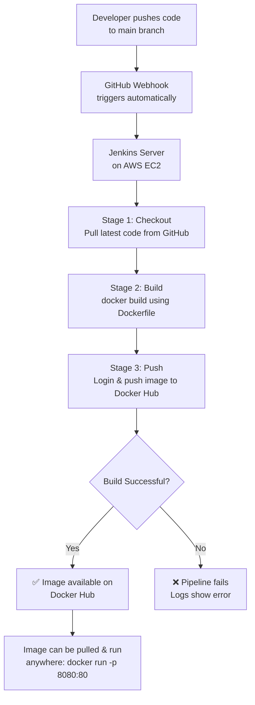

# Static Website Deployment with Docker & Jenkins CI/CD

## 📌 Overview
This project automates the hosting of a simple static HTML/CSS website using Docker containers, with a fully automated CI/CD pipeline built using Jenkins. Every push to the `main` branch automatically triggers a pipeline that builds a Docker image and pushes it to Docker Hub — no manual steps required.

## 🎯 Goal
Demonstrate a real-world DevOps workflow: Git branching practices, containerization with Docker, and CI/CD automation with Jenkins.

## 🛠️ Tech Stack
- **Version Control:** Git & GitHub
- **Containerization:** Docker (Nginx Alpine base image)
- **CI/CD:** Jenkins (self-hosted on AWS EC2)
- **Image Registry:** Docker Hub
- **Automation Trigger:** GitHub Webhooks

## 🏗️ Architecture Flow



## 🔄 How It Works — Step by Step

1. **Code Change:** A developer edits the website files (`index.html`, `style.css`) and pushes the change to the `main` branch on GitHub.
2. **Webhook Trigger:** GitHub automatically sends a POST request to the Jenkins server (`/github-webhook/`) notifying it of the push.
3. **Pipeline Starts:** Jenkins picks up the `Jenkinsfile` from the repository and begins execution.
4. **Checkout Stage:** Jenkins pulls the latest code from the `main` branch into its workspace.
5. **Build Stage:** Jenkins runs `docker build` using the project's `Dockerfile`, which uses an `nginx:alpine` base image and copies the static site files into it.
6. **Push Stage:** Jenkins logs into Docker Hub using securely stored credentials and pushes the newly built image.
7. **Result:** If all stages pass, the pipeline reports success and the updated image is live on Docker Hub, ready to be pulled and run on any server.

## 📂 Project Structure
```
static-site-deployment/
├── index.html          # Website homepage
├── style.css            # Website styling
├── Dockerfile            # Defines how to containerize the site with Nginx
├── .dockerignore         # Excludes unnecessary files from the image
├── Jenkinsfile           # Defines the CI/CD pipeline stages
└── README.md             # Project documentation
```

## 🐳 Dockerfile
```dockerfile
FROM nginx:alpine
COPY . /usr/share/nginx/html
EXPOSE 80
```

## ⚙️ Jenkins Pipeline Stages
| Stage | What It Does |
|---|---|
| Checkout | Pulls latest code from GitHub `main` branch |
| Build Docker Image | Builds the Docker image using the Dockerfile |
| Push to Docker Hub | Authenticates and pushes the image to Docker Hub |

## 🌿 Git Workflow
- `main` — production-ready, stable branch
- `feature/*` — used for developing and testing changes before merging via Pull Request

## 🚀 Running Locally
```bash
docker build -t static-site .
docker run -d -p 8080:80 --name mywebsite static-site
```
Then visit `http://localhost:8080`

## 🔑 Key Learnings
- Setting up Git branching & Pull Request workflows
- Writing a Dockerfile for a static site using Nginx
- Installing and configuring Jenkins on an EC2 instance
- Configuring GitHub Webhooks for automatic pipeline triggers
- Managing Docker Hub credentials securely using Jenkins Credentials Store
- Debugging real pipeline issues: port conflicts, HTTPS/HTTP webhook mismatches, branch name mismatches, and authentication errors
